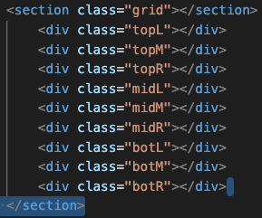

# tic-tac-toe
tic tac toe is a 3*3 two player game that is taken in turns one by one. 
The winner of this game is when someone has three of there character in a row, either horizontal, diagonal or vertically 

### step 1:
- create 9 divs

- Style into a 3*3 grid 

### step 2: 
- add event listner to detect clicks on each box.
`.addEventListener("click", function () {}})`
### step 3:
- check to see if there is already an input in the box clicked if not go on. if it has been clicked and filled then do nothing. 
- turn the click into inputing an X for player one if there is no input in the box clicked. 
### step 4:
- check to see if there is a winner by having 3 in a row after every click  of X or O to see if someone has won. something like this to track if 
- create var that contains all the possible ways X's can win
- create var for all the ways O's can win.
- if winner then display win text/or annimation if enough themeing time. 
### step: 5 
- if no winner then go to next player and run it again. 
`if (X was previous run step 4){next person play}`
- when box is clicked check to see if box already has an input in this box. get player to select a different box
- mark clicked box with input of the second player
- check for win condtion
- if no winner go to next player 
- if winner display win

### step: 6 
- after winner put in a restart option to go back to start of a blank game. 

### things i added 
- two types of font styles, Rowdies for the X's and O's and text that changes. The other font style is for the headings that do not change. this style is Permanent marker. 
- Added a resturt button that has an animation when you hover over it and also when you either win or a draw it will animate. 
- put in a gif as the background. 